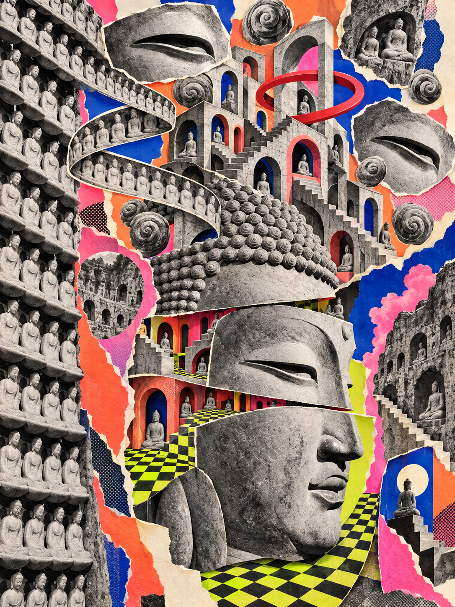
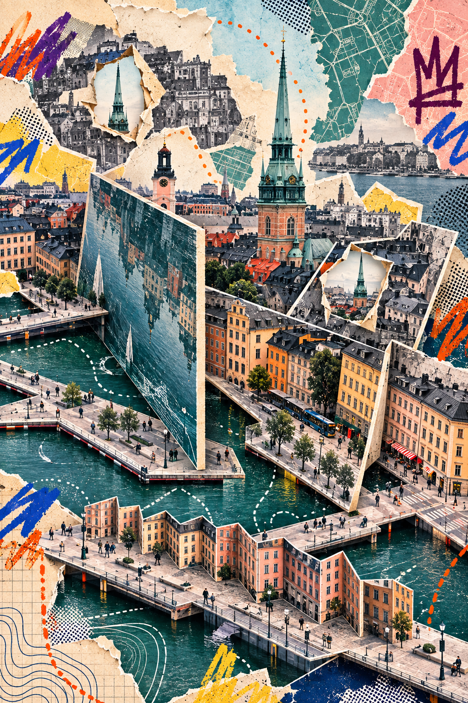
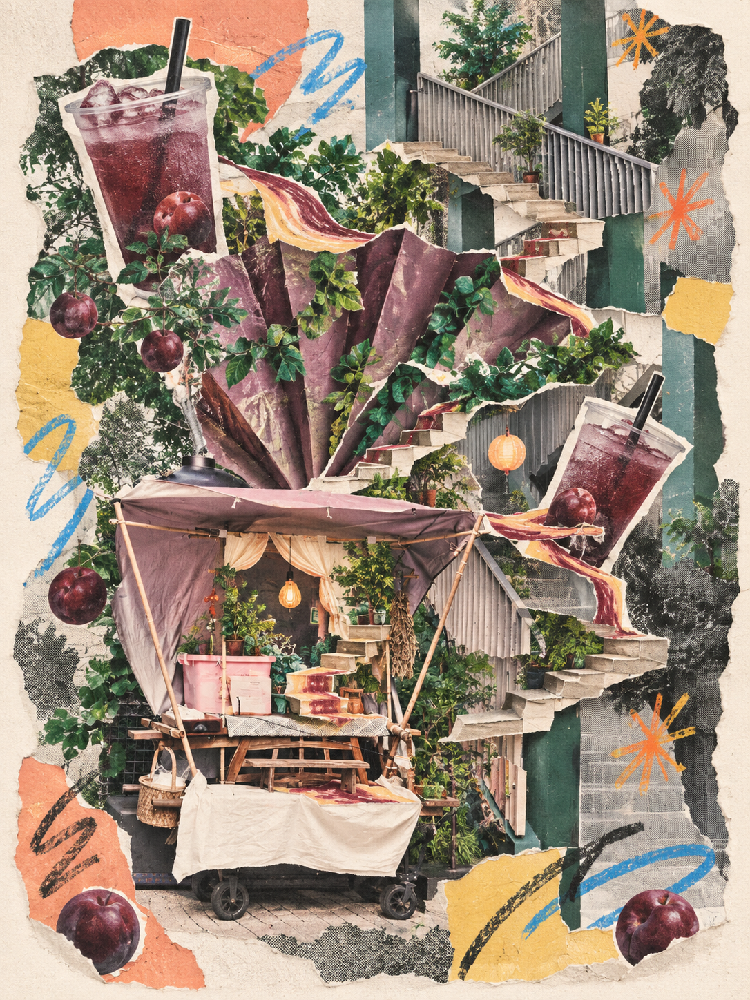

# Bizarre Photo Collage · 怪诞摄影拼贴

Turn reference photos into richly layered, bizarre handmade collages while keeping their subjects recognizable. Combine displaced photographic slices, recursive details, impossible spaces, torn paper, print textures, and freely designed graffiti colors.

This is a derivative of **Surreal Pop Collage**, not an entirely original skill. The original project's attribution and MIT license are preserved below.

## Credits and origin

- **Original skill:** [surreal-pop-collage](https://github.com/2998980-hue/surreal-pop-collage), published under the GitHub account **2998980-hue**.
- **Original author recorded in the inherited Git history:** **chenzeqian123**, in commit `5bcf6f5` (`v1.0: surreal pop collage skill — B&W photo anchor, flat color shapes, one impossible element`). The repository owner and recorded commit author are credited separately rather than assumed to be the same person.
- **This derivative:** [bizarre-photo-collage](https://github.com/dearkatrina1226/bizarre-photo-collage), maintained by **dearkatrina1226**.

The original provides the foundation: recognizable photographic subjects, scene-derived surreal elements, color contrast, prompt construction, and visual quality checks. This adaptation builds on that work. It does not imply endorsement by the original author or repository owner.

## What changed

| Area | Original skill | This derivative |
| --- | --- | --- |
| Default direction | A black-and-white photographic anchor against large flat color shapes | Rich, bizarre handmade photographic collage |
| Surreal elements | Exactly one impossible giant object | Multiple related anomalies with a clear visual hierarchy |
| Spatial composition | Preserve the scene and add an oversized intervention | Displaced slices, recursive repetition, nested interiors, inside-out spaces, and impossible overlaps |
| Materials | Strict flat-color treatment without dimensional shadows | Torn edges, scissor cuts, paper backs, selective halftone, print misregistration, and local layer shadows |
| Color | Colors derived from the source or a contrasting strategy | Broader contrasting and fluorescent accents, selected for each image |
| Graffiti | A few white hand-drawn strokes and a prescribed small-element arrangement | Optional marks with varied colors, shapes, weights, and arrangements |
| Reuse | A constrained single-object recipe | Scene-specific motifs; avoid repeating the same eyes, stairs, rings, or checkerboards across unrelated photos |
| Identity | `surreal-pop-collage` | `bizarre-photo-collage`, with updated display name and invocation prompt |

The subject should still be recognizable. Details should come from the reference scene, and dense areas should be balanced with quieter areas. “Bizarre” does not default to gore or horror. A simpler composition remains available when requested.

## Installation

Copy `SKILL.md` and the `agents/` directory into a skill folder named `bizarre-photo-collage` in your agent's configured skills directory. For a standard Codex installation, the resulting structure is:

```text
~/.agents/skills/bizarre-photo-collage/
├── SKILL.md
└── agents/
    └── openai.yaml
```

When redistributing the skill, also retain `LICENSE` and this attribution. This is an instruction-based skill, not a standalone image-generation application: the host needs an available image-generation capability. The skill instructions are written in Chinese; requests can be made in Chinese or English.

## Usage

Attach a reference photo and request:

```text
Use $bizarre-photo-collage to reinterpret this photo as a bizarre handmade collage.
Keep the subject recognizable and freely design the graffiti colors.
```

```text
用 $bizarre-photo-collage 把这张照片做成怪诞手工拼贴。
保留主体辨识度，涂鸦颜色自由设计，不要重复之前的配色和元素。
```

For multiple photos, specify whether you want separate artworks or one combined composition. You can also specify aspect ratio, preferred colors, or details that must stay intact.

The complete creative workflow is in [SKILL.md](SKILL.md). The original guidance in [examples/README.md](examples/README.md) is retained as legacy material; it describes the earlier, simpler style. No sample image files are currently included in this repository.
## Examples






## Repository contents

- `SKILL.md` — creative instructions for the derivative skill.
- `agents/openai.yaml` — display metadata and default invocation prompt.
- `LICENSE` — original MIT license, preserved unchanged.
- `examples/README.md` — inherited example guidance, preserved unchanged.

## License

This derivative is distributed under the [MIT License](LICENSE). The original license file, including its `Copyright (c) 2026` notice, is preserved verbatim. No named copyright holder has been invented or substituted for the original notice.

The license applies to the repository's skill materials. It does not grant rights to third-party reference photos, brands, or other external content used with the skill.

The derivative copyright notice created in this repository's initial GitHub commit is also retained in [LICENSE-DERIVATIVE](LICENSE-DERIVATIVE), under the same MIT terms.
